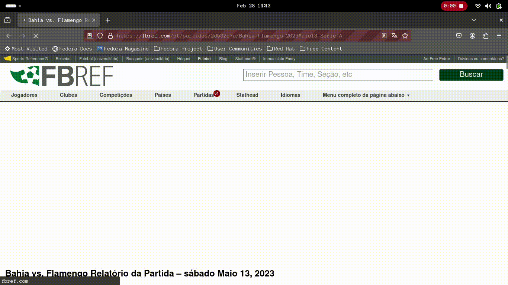
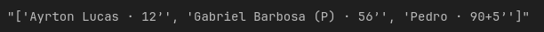
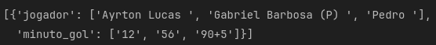
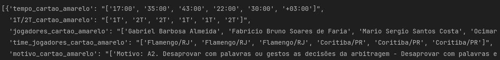
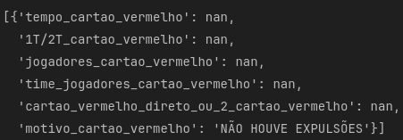
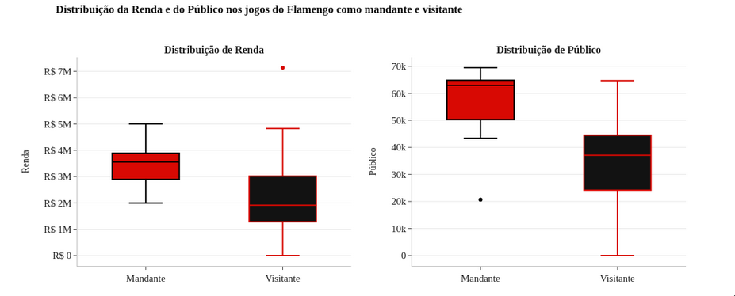

# Análise Exploratória dos dados do Time do Flamengo no Campeonato Brasileiro de 2023

## Parte I: Obtenção dos dados
###### Obtenção dos dados do time do flamengo no brasileirão 2023.
---

Para a coleta dos dados do Mengão no Brasileirão 2023, eu fiz um web scrapping utilizando o Selenium.  

Foi coletado o seguinte:
- Estatísticas das partidas do flamengo no site da [FBref.](https://fbref.com/pt/)
- Baixei as súmulas online do site da [CBF](https://www.cbf.com.br/) utilizando a página que continha o link para o download desses arquivos na [Wikipédia.](https://pt.wikipedia.org/wiki/Temporada_do_Clube_de_Regatas_do_Flamengo_de_2023#Campeonato_Brasileiro_2)
- As súmulas foram usadas para pegar as informações dos cartões e substituições das partidas.
- A informações do público e renda foram coletadas do site da [Wikipédia.](https://pt.wikipedia.org/wiki/Temporada_do_Clube_de_Regatas_do_Flamengo_de_2023#Campeonato_Brasileiro_2)

Abaixo, você pode ver dois gifs do script do web scrapping em ação. O primeiro baixa as súmulas e o segundo coleta as estatíticas das partidas.

  

  

- Para fazer a leitura das informações dos cartões e das substituições das súmulas que são arquivos pdfs, eu utilizei a bibioteca [`pdfplumber`](https://pypi.org/project/pdfplumber/) e depois utilizei o [`pandas`](https://pandas.pydata.org/) para gravar as informações em arquivos csvs. Também utilizei a biblioteca [`pathlib`](https://docs.python.org/3/library/pathlib.html) para renomear os arquivos de acordo com a rodada.  

- Alguns arquivos deram problemas, que foram os arquivos da rodada 6 e 15, então como era poucas informações eu optei por colocar as informações desses dois arquivos manualmente no csv. 

- As informações das estatísticas das partidas eu gravei em arquivos txt e utilizei o [`pandas`](https://pandas.pydata.org/) para gravar essas informações em um `DataFrame`.  

- Para juntar todas essas informações eu utilizei a função `pd.concat()` do pandas para juntar as informações em um único `DataFrame` e gravei em um arquivo csv chamado `estatisticas_flamengo_brasileiro_2023.csv`. 

# Parte II: Tratamento dos dados
###### Tratamendo dos dados que foram obtidos através do webscrapping.
---

Nessa parte II, eu fiz um tratamento geral nos dados para facilitar na hora de se fazer a análise exploratória (parte III).
Os tratamentos que foram feitos são:
- Mudei as colunas com dados numéricos para o tipo correto e também mudei a coluna referente a data para o tipo correto correspondente.
- Juntei as colunas `data_jogo` e `horario_jogo` em uma coluna só chamada `data_horario_jogo`.
- Algumas colunas estavam com os dados com informações redundantes, por exemplo a coluna var_jogo em seus dados tinha  'nome do árbitro (VAR)' e como o nome da coluna já explicita o que o dado se refere removi essas informações redundantes.
- Na coluna `gols_jogo` as informações estavam dessa maneira:  então optei em fazer um dicionário para as informações ficarem melhores separadas, ficando assim: 
- Também juntei todas as informações sobre os cartões amarelos em uma coluna chamada `info_cartoes_amarelos`, sobre os cartões vermelhos em uma coluna chamada `info_cartoes_vermelhos` e sobre as substituições em uma coluna chamada `info_substituicoes. As informações ficaram assim, respectivamente:  

  

  

  

# Parte III: Análise exploratória dos dados
###### Análise exploratória dos dados do time do Flamengo no Brasileirão 2023.
---

Nessa parte III, eu fiz uma análise exploratória dos dados obtidos na parte I e tratados na parte II.  

Foram respondidas as seguintes perguntas: 
- Qual é a média de posse de bola do Flamengo em casa e fora de casa ao longo da temporada?

- Em qual jogo o Flamengo teve a maior porcentagem de posse de bola e a menor porcentagem ?

- Existe alguma correlação entre a porcentagem de passes certos e o número de gols marcados pelo Flamengo em cada partida?

- Qual foi a distribuição de renda e público nos jogos do Flamengo como mandante e visitante ?

- Como a quantidade de chutes certos do Flamengo se compara com a quantidade de gols marcados em casa e fora de casa?

- Qual foi o desempenho do Flamengo em relação a cartões amarelos e vermelhos? Houve algum jogador que recebeu muitos cartões?

- Qual foi a quantidade de vitórias, derrotas e empates do Flamengo jogando como mandante e visitante? E no campeonato todo ?

Os principais insights dessa análise foram:  
--- 

---
A maior e a menor porcentagem de posse de bola do Flamengo jogando como mandante é:  

**Maior**: rodada 3 74% de posse de bola  
**Menor**: rodada 34 42% de posse de bola  

A maior e a menor porcentagem de posse de bola do Flamengo jogando como visitante é:  

**Maior**: rodada 11 59% de posse de bola  
**Menor**: rodada 12 33% de posse de bola  

- Como pode ser observado, o jogo que o Flamengo teve a maior porcentagem de posse de bola jogando como mandante foi na rodada 3 Flamengo X Botafogo, já a menor foi na rodada 33 Flamengo x Fluminense.  

- Agora, como visitante, o jogo que o Flamengo obteve a maior porcentagem de posse de bola foi na rodada 11 Bragantino x Flamengo, já a menor foi na rodada 12 Santos x Flamengo.  

--- 

Olhando os gáficos acima pode-se chegar as seguintes conclusões:

- Existe um outlier no limite superior na distribuição de renda quando o flamengo foi visitante e um outlier no limite inferior na distribuição de público quando o flamengo foi mandante.  

- O primeiro outlier ocorreu no jogo entre Fortaleza X Flamengo válido pela rodada 32 no Castelão, já o segundo ocorreu no jogo entre Flamengo X Athletico Paranaense válido pela rodada 23 no Maracanã.  

- Fazendo uma pesquisa de o porque desse outlier do público ter sido muito baixo descobri que o jogo foi no Espírito Santo no estádio Kleber Andrade e não no Maracanã como diz o dataset, então está explicado porque o público foi baixo mesmo o Flamengo sendo mandante.  

- Observa-se também que a distribuição de renda e público com o Flamengo sendo mandante não há muita variação principalmente em público.

--- 

Flamengo como mandante:
- Quantidade de chutes certos na maioria das partidas: [4]
- Quantidade de gols na maioria das partidas: [1]
- Máximo de chutes certos: 13
- Mínimo de chutes certos: 2  

Flamengo como visitante:
- Quantidade de chutes certos na maioria das partidas: [4]
- Quantidade de gols na maioria das partidas: [0 2]
- Máximo de chutes certos: 8
- Mínimo de chutes certos: 0  

- Pelos dados acima vemos que o time do Flamengo precisava dar pelo menos 4 chutes certos para marcar pelo menos um gol, o que mostra uma baixa eficiência em acertar o gol.
